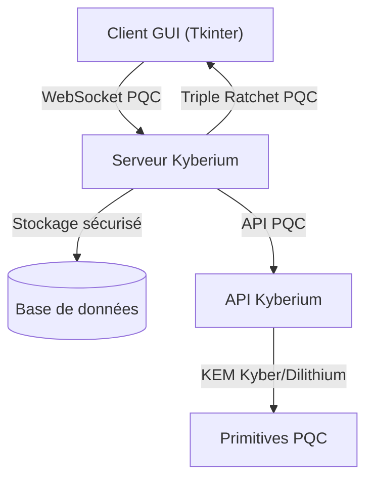
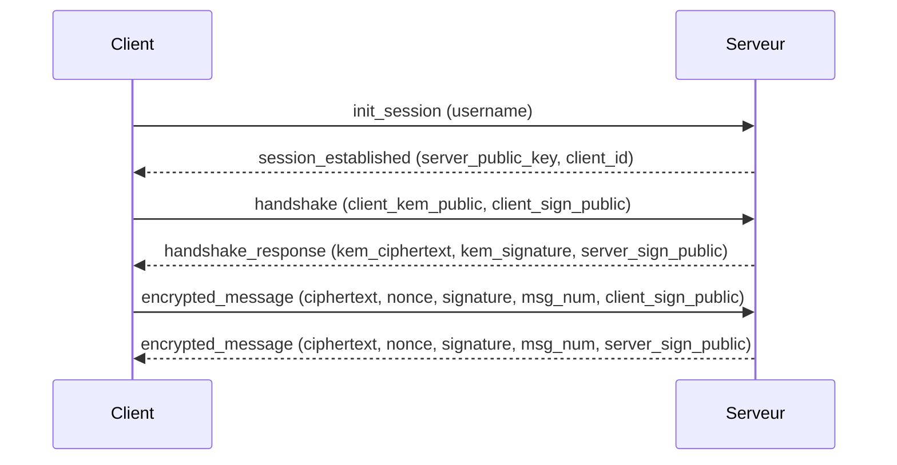

# Kyberium – Protocole de messagerie post-quantique

[](https://www.gnu.org/licenses/gpl-3.0.html)
[](docs/audit_conformite_gplv3_kyberium.md)


> **Résumé exécutif** :
> Ce projet est intégralement placé sous licence GNU GPL v3 (2025, RhaB17369). Toute utilisation, modification ou distribution doit respecter les termes de cette licence. Voir le fichier LICENSE pour les détails et obligations de conformité.

---

## 🧬 Présentation scientifique et inspiration architecturale

**Kyberium** est un protocole de messagerie instantanée sécurisé, inspiré de l’architecture du protocole Signal (cf. Moxie Marlinspike, Trevor Perrin, Signal Protocol RFC), mais intégralement repensé pour la résistance post-quantique. Là où Signal repose sur des primitives classiques (ECDH, Ed25519, AES), Kyberium implémente exclusivement des primitives cryptographiques post-quantiques reconnues et standardisées :

- **Échange de clés** : CRYSTALS-Kyber (NIST PQC Standard)
- **Signatures** : CRYSTALS-Dilithium (NIST PQC Standard)
- **Chiffrement symétrique** : AES-GCM ou ChaCha20-Poly1305
- **Triple Ratchet** : Adaptation post-quantique du mécanisme Signal
- **Dérivation de clés** : SHA-3/SHAKE-256

Cette approche garantit une sécurité durable face aux menaces quantiques, tout en conservant la robustesse, la confidentialité persistante (PFS) et la simplicité d’usage qui ont fait le succès de Signal. L’implémentation suit une rigueur scientifique extrême, avec une documentation exhaustive, des tests avancés, et une conformité stricte à la licence GNU GPL v3.

> **Encadré Sécurité** :
> - Toutes les primitives cryptographiques sont post-quantiques (aucune courbe elliptique ni RSA)
> - Les échanges de clés et signatures reposent sur Kyber et Dilithium
> - Le Triple Ratchet est adapté pour la résistance quantique
> - L’architecture logicielle est conçue pour l’auditabilité, la modularité et la conformité réglementaire

---

## 🔬 Description détaillée du protocole Kyberium

Kyberium vise à offrir une messagerie instantanée hautement sécurisée, résiliente face aux attaques quantiques, et conforme aux exigences des environnements critiques (gouvernement, défense, industrie). Le protocole repose sur :

- **Initialisation de session** : Authentification forte, génération de secrets partagés via Kyber
- **Handshake post-quantique** : Échange de clés et signatures avec vérification mutuelle (Kyber/Dilithium)
- **Triple Ratchet post-quantique** : Renouvellement automatique des clés à chaque message, garantissant la PFS et la confidentialité future
- **Chiffrement symétrique** : AES-GCM ou ChaCha20-Poly1305 pour la rapidité et la robustesse
- **Gestion des identités** : Signatures Dilithium pour l’authenticité et la non-répudiation
- **Protection contre les attaques** : Rejeu, interception, rétro-ingénierie quantique
- **Auditabilité** : Traces, logs, et documentation exhaustive pour vérification indépendante

L’ensemble du code est développé selon les standards de l’industrie, avec une attention extrême portée à la sécurité, la clarté, la modularité et la conformité.

---

## 🏗️ Architecture générale (schéma Mermaid)



---

## 🖼️ Diagrammes et illustrations

### Diagramme de modules


### Diagramme de séquence


### Diagramme de flux du protocole Kyberium


### Diagramme de flux du messenger


### Diagramme global Kyberium


### Diagramme de classes du protocole


### Animation de sécurité


---

## 📦 Structure du projet

- `kyberium/` : Bibliothèque principale (primitives, ratchet, API, etc.)
- `messenger_app/` : Application de messagerie graphique (serveur, client, GUI, tests)
- `docs/` : Documentation technique, audit, architecture
- `tests/` : Tests unitaires et d’intégration
- `img/` : Logos, schémas, illustrations

---

## 🧪 Tests et validation

### Tests de l’application Messenger (GUI)

- Lancer la démonstration complète :
```bash
python messenger_app/demo_gui.py
```
- Ou démarrer manuellement :
```bash
python messenger_app/kyberium_server.py
python messenger_app/kyberium_gui_client.py
```
- Se connecter avec différents noms d’utilisateur
- Échanger des messages sécurisés

#### Espaces réservés pour images de tests Messenger (GUI)

| Test 1 | Test 2 | Test 3 | Test 4 | Test 5 | Test 6 |
|--------|--------|--------|--------|--------|--------|
|        |        |        |        |        |        |

### Tests du protocole Kyberium (cryptographie, Triple Ratchet, etc.)

- Tests unitaires et d’intégration dans le dossier `tests/`
- Validation du Triple Ratchet post-quantique avec `messenger_app/debug_triple_ratchet.py`
- Couverture complète des primitives Kyber, Dilithium, SHA-3, AES-GCM, ChaCha20

#### Espaces réservés pour images de tests du protocole Kyberium

| Test 1 | Test 2 | Test 3 | Test 4 | Test 5 | Test 6 |
|--------|--------|--------|--------|--------|--------|
|        |        |        |        |        |        |

---

## 🔄 Protocole de communication (schéma Mermaid)



---

## 🎯 Fonctionnalités principales

### Sécurité

- ✅ Chiffrement end-to-end post-quantique
- ✅ Authentification des messages
- ✅ Perfect Forward Secrecy (PFS)
- ✅ Protection contre les attaques quantiques
- ✅ Rotation automatique des clés

### Messagerie

- ✅ Messages en temps réel
- ✅ Salles de chat multiples
- ✅ Liste des utilisateurs connectés
- ✅ Interface graphique intuitive
- ✅ Notifications système

### Interface Graphique

- ✅ Thème sombre moderne et professionnel
- ✅ Zone de messages avec scroll automatique
- ✅ Indicateurs de statut en temps réel
- ✅ Gestion des erreurs avec messages informatifs
- ✅ Interface responsive et intuitive
- ✅ Couleurs distinctives pour la sécurité

---

## 🔧 Configuration

### Serveur

Modifier les paramètres dans `messenger_app/kyberium_server.py` :

```python
host = "localhost"  # Adresse du serveur
port = 8765         # Port du serveur
```

### Client Graphique

Modifier l’URL du serveur dans l’interface ou dans `messenger_app/kyberium_gui_client.py` :

```python
server_url = "ws://localhost:8765"  # URL du serveur
```

---

## 📊 Performance

### Métriques typiques

- **Latence de connexion** : < 100ms
- **Temps de chiffrement** : < 10ms par message
- **Temps de déchiffrement** : < 10ms par message
- **Taille des messages** : ~200 bytes de surcharge par message

### Optimisations

- Chiffrement asynchrone
- Gestion des sessions en mémoire
- Compression des métadonnées
- Cache des clés de session

---

## 🐛 Dépannage

### Problèmes courants

1. **Erreur de connexion**
   - Vérifier que le serveur est démarré
   - Vérifier le port 8765 disponible

2. **Erreur de chiffrement**
   - Vérifier l’installation de Kyberium
   - Redémarrer le client

3. **Interface non responsive**
   - Vérifier les permissions Tkinter
   - Redémarrer l’application

### Logs

Les logs sont affichés dans la console :
- Serveur : Informations de connexion et erreurs
- Client : État de la connexion et erreurs

---

## 🔮 Évolutions futures

- Support des messages privés
- Chiffrement des fichiers
- Interface web
- Applications mobiles
- Intégration avec d’autres protocoles

---

## 📄 Licence

Ce projet est sous licence **GNU GPL v3 (2025, RhaB17369)**. Voir le fichier LICENSE pour plus de détails et les obligations de conformité.

---

## 📚 Documentation

- [Audit de conformité GNU GPL v3](docs/audit_conformite_gplv3_kyberium.md)
- [Architecture détaillée](docs/architecture.md)
- [Référence API](docs/api_reference.md)

---

## 📖 Références scientifiques

- Signal Protocol RFC, M. Marlinspike, T. Perrin, Open Whisper Systems
- NIST FIPS 203 : CRYSTALS-Kyber
- NIST FIPS 204 : CRYSTALS-Dilithium
- NIST SP 800-56C, SP 800-90A/B/C (KDF, RNG)
- Publications sur la sécurité post-quantique (voir docs/architecture.md)

---

## 🗂️ Glossaire

- **PQC** : Post-Quantum Cryptography (cryptographie résistante aux ordinateurs quantiques)
- **KEM** : Key Encapsulation Mechanism (mécanisme d’encapsulation de clé)
- **CRYSTALS-Kyber** : Algorithme d’échange de clés post-quantique standardisé par le NIST
- **CRYSTALS-Dilithium** : Algorithme de signature post-quantique standardisé par le NIST
- **Triple Ratchet** : Mécanisme de renouvellement de clés assurant la PFS
- **PFS** : Perfect Forward Secrecy (confidentialité persistante)
- **AES-GCM** : Mode de chiffrement symétrique authentifié
- **SHA-3/SHAKE-256** : Fonctions de hachage cryptographique
- **Auditabilité** : Capacité à vérifier la conformité et la sécurité du code
- **Non-répudiation** : Garantie qu’un message ne peut être nié par son auteur

---

## 🤝 Contribution

Toute contribution doit respecter la licence GNU GPL v3 et la politique de conformité du projet. Consultez l’[audit de conformité](docs/audit_conformite_gplv3_kyberium.md) avant toute soumission.

---

## 📞 Support

Pour toute question, problème ou demande de contact professionnel :

- Ouvrir une issue sur GitHub
- Consulter la documentation
- Tester avec les exemples fournis
- **Contact direct développeur** : maloumbriceharold@gmail.com

---

## 💸 Soutien et financement

Kyberium est un projet open source à vocation scientifique et sécuritaire. Pour toute proposition de financement, sponsoring, mécénat ou partenariat, merci de contacter directement le développeur principal à l’adresse suivante :

**rhab17369@protonmail.com**

Un dossier de présentation, des audits techniques et des démonstrations peuvent être fournis sur demande.

---

## 🕑 Historique des modifications majeures

- **2025-04** : Migration de la licence MIT vers GNU GPL v3 (RhaB17369), synchronisation documentaire, nettoyage et conformité totale.
- **2024-12** : Ajout du support Triple Ratchet, refonte sécurité, documentation avancée.
- **2024-10** : Première version publique, licence MIT initiale.

