# Rapport d’audit de conformité GNU GPL v3 – Kyberium

**Date :** 2025-07
**Responsable conformité :** RhaB17369

---

## 1. Portée de l’audit

Cet audit couvre l’ensemble du projet Kyberium, incluant :
- Le cœur de la bibliothèque (`kyberium/` et sous-dossiers)
- Les scripts et serveurs de `messenger_app/`
- Les tests (`tests/` et sous-dossiers)
- Les guides et README principaux (racine, messenger_app, flutter_app)

## 2. Conformité des fichiers source

- **Tous les fichiers Python** de `kyberium/` et sous-dossiers comportent le header GNU GPL v3 (2025, RhaB17369).
- **Tous les scripts principaux** de `messenger_app/` (serveur, client, debug) comportent le header GNU GPL v3.
- **Tous les fichiers de tests** (`tests/` et sous-dossiers) comportent le header GNU GPL v3.
- **Tous les fichiers d’initialisation** (`__init__.py`) sont couverts.
- **Aucun vestige de l’ancienne licence MIT** n’a été détecté dans le code source Python, les scripts, ou la documentation principale.

## 3. Synchronisation documentaire

- Les README de `messenger_app/` et `messenger_app/flutter_app/` comportent :
  - Un encadré de conformité GNU GPL v3 en haut
  - Une section licence synchronisée
  - Un historique des modifications majeures
- Les guides et README font référence à la bonne licence et à la structure réelle du projet.
- Les encadrés de conformité sont visibles dès le début des README pour garantir la clarté juridique.

## 4. Historique des migrations majeures

- **2025-07** : Migration de la licence MIT vers GNU GPL v3 (RhaB17369), synchronisation documentaire, nettoyage et conformité totale.
- **2025-06** : Ajout du support Triple Ratchet, refonte sécurité, documentation avancée.
- **2025-05** : Première version publique, licence MIT initiale.

## 5. Conclusion

Le projet Kyberium est **intégralement conforme** à la licence GNU GPL v3 (2025, RhaB17369), sans aucun vestige de l’ancienne licence MIT, avec une documentation et un historique synchronisés, dignes des standards professionnels les plus stricts.

---

## 6. Validation finale

Après revue complète du code, des scripts, des tests et de la documentation :

- Tous les fichiers sont couverts par le header GNU GPL v3 (2025, RhaB17369).
- Tous les README et guides affichent la conformité, les badges, et l’historique.
- Aucun vestige de l’ancienne licence MIT n’est présent.
- L’audit, la synchronisation documentaire et la politique de contribution sont effectifs.

**Validation finale effectuée par l’utilisateur et l’assistant.**

**Date de validation :** 2025-04

*Ce rapport peut être archivé, publié ou communiqué à toute autorité de conformité, partenaire ou contributeur.* 

## 🖼️ Diagrammes et illustrations

### Diagramme de modules

### Diagramme de séquence

### Diagramme de flux du protocole Kyberium

### Diagramme de flux du messenger

### Diagramme global Kyberium

### Diagramme de classes du protocole

### Animation de sécurité

## 📞 Support

Pour toute question, problème ou demande de contact professionnel :

- Ouvrir une issue sur GitHub
- Consulter la documentation
- **Contact direct développeur** : maloumbriceharold@gmail.com

---

## 💸 Soutien et financement

Kyberium est un projet open source à vocation scientifique et sécuritaire. Pour toute proposition de financement, sponsoring, mécénat ou partenariat, merci de contacter directement le développeur principal à l’adresse suivante :

**maloumbriceharold@gmail.com**

Un dossier de présentation, des audits techniques et des démonstrations peuvent être fournis sur demande. 