# Kyberium - Diagramme de Classes Mermaid

## Vue d'ensemble

Ce diagramme présente l'architecture complète du projet Kyberium en utilisant la syntaxe Mermaid, permettant une visualisation interactive et professionnelle de l'architecture post-quantique.

## Diagramme de Classes Principal KYBERIUM MESSENGER

```mermaid
classDiagram
    %% ============================================================================
    %% INTERFACES CRYPTOGRAPHIQUES (ABSTRACT)
    %% ============================================================================
    
    class KEMInterface {
        <<interface>>
        + {abstract} generate_keypair() tuple[bytes, bytes]
        + {abstract} encapsulate(public_key: bytes) tuple[bytes, bytes]
        + {abstract} decapsulate(ciphertext: bytes, private_key: bytes) bytes
    }
    
    class SignatureInterface {
        <<interface>>
        + {abstract} generate_keypair() tuple[bytes, bytes]
        + {abstract} sign(message: bytes, private_key: bytes) bytes
        + {abstract} verify(message: bytes, signature: bytes, public_key: bytes) bool
    }
    
    class SymmetricCipherInterface {
        <<interface>>
        + {abstract} encrypt(plaintext: bytes, key: bytes, nonce?: bytes, aad?: bytes) tuple[bytes, bytes]
        + {abstract} decrypt(ciphertext: bytes, key: bytes, nonce: bytes, aad?: bytes) bytes
    }
    
    class KDFInterface {
        <<interface>>
        + {abstract} derive_key(input_key_material: bytes, length: int, salt?: bytes, info?: bytes) bytes
    }
    
    class DoubleRatchetInterface {
        <<interface>>
        + {abstract} initialize(shared_secret: bytes, root_key?: bytes) void
        + {abstract} ratchet_encrypt(plaintext: bytes) dict
        + {abstract} ratchet_decrypt(ciphertext: bytes, metadata: dict) bytes
        + {abstract} rekey() void
    }
    
    %% ============================================================================
    %% IMPLÉMENTATIONS CRYPTOGRAPHIQUES
    %% ============================================================================
    
    class Kyber1024 {
        - kem: ml_kem_1024
        + generate_keypair() tuple[bytes, bytes]
        + encapsulate(public_key: bytes) tuple[bytes, bytes]
        + decapsulate(ciphertext: bytes, private_key: bytes) bytes
        + get_algorithm_info() dict
    }
    
    class DilithiumSignature {
        - signature: ml_dsa_65
        + generate_keypair() tuple[bytes, bytes]
        + sign(message: bytes, private_key: bytes) bytes
        + verify(message: bytes, signature: bytes, public_key: bytes) bool
        + get_algorithm_info() dict
    }
    
    class AESGCMCipher {
        - key_size: int
        - nonce_size: int
        + encrypt(plaintext: bytes, key: bytes, nonce?: bytes, aad?: bytes) tuple[bytes, bytes]
        + decrypt(ciphertext: bytes, key: bytes, nonce: bytes, aad?: bytes) bytes
    }
    
    class ChaCha20Cipher {
        - key_size: int
        - nonce_size: int
        + encrypt(plaintext: bytes, key: bytes, nonce?: bytes, aad?: bytes) tuple[bytes, bytes]
        + decrypt(ciphertext: bytes, key: bytes, nonce: bytes, aad?: bytes) bytes
    }
    
    class SHA3KDF {
        - hash_algorithm: hashes.HashAlgorithm
        + derive_key(input_key_material: bytes, length: int, salt?: bytes, info?: bytes) bytes
    }
    
    class SHAKE256KDF {
        + derive_key(input_key_material: bytes, length: int, salt?: bytes, info?: bytes) bytes
    }
    
    %% ============================================================================
    %% GESTIONNAIRE DE SESSION ET RATCHET
    %% ============================================================================
    
    class SessionManager {
        - kem: KEMInterface
        - kdf: KDFInterface
        - signature: SignatureInterface
        - symmetric: SymmetricCipherInterface
        - session_keys: dict
        - handshake_done: bool
        - peer_public_key: bytes
        - own_keypair: tuple[bytes, bytes]
        - shared_secret: bytes
        - session_id: str
        - use_triple_ratchet: bool
        - triple_ratchet: TripleRatchet
        - own_sign_keypair: tuple[bytes, bytes]
        - peer_sign_public_key: bytes
        
        + __init__(kem?, kdf?, signature?, symmetric?, symmetric_key_size: int, kdf_type: str, symmetric_type: str, use_triple_ratchet: bool)
        + generate_kem_keypair() tuple[bytes, bytes]
        + set_peer_public_key(public_key: bytes) void
        + perform_handshake() bytes
        + complete_handshake(ciphertext: bytes) bool
        + encrypt(plaintext: bytes, aad?: bytes) tuple[bytes, bytes]
        + decrypt(ciphertext: bytes, nonce: bytes, aad?: bytes) bytes
        + sign(message: bytes) bytes
        + verify(message: bytes, signature: bytes, public_key?: bytes) bool
        + get_session_info() dict
    }
    
    class TripleRatchet {
        - kem: KEMInterface
        - kdf: KDFInterface
        - signature: SignatureInterface
        - symmetric: SymmetricCipherInterface
        - DHs: tuple[bytes, bytes]
        - DHr: bytes
        - root_key: bytes
        - send_chain_key: bytes
        - recv_chain_key: bytes
        - send_message_number: int
        - recv_message_number: int
        - skipped_message_keys: dict
        - own_sign_keypair: tuple[bytes, bytes]
        - peer_sign_public_key: bytes
        - handshake_done: bool
        
        + __init__(kem?, kdf?, signature?, symmetric?, symmetric_key_size: int, own_kem_keypair?: tuple[bytes, bytes])
        + initialize(peer_kem_public: bytes, peer_sign_public: bytes) bytes
        + complete_handshake(kem_ciphertext: bytes, kem_signature: bytes, peer_sign_public: bytes) bool
        + ratchet_encrypt(plaintext: bytes, aad?: bytes) dict
        + ratchet_decrypt(ciphertext: bytes, nonce: bytes, signature: bytes, msg_num: int, peer_sign_public: bytes, aad?: bytes) bytes
        + get_ratchet_info() dict
    }
    
    %% ============================================================================
    %% API PUBLIQUE
    %% ============================================================================
    
    class KyberiumAPI {
        - session: SessionManager
        - triple_ratchet: TripleRatchet
        
        + init_session(peer_public_key?: bytes, kdf_type: str, symmetric_type: str) bytes
        + complete_handshake(ciphertext: bytes) bool
        + encrypt(plaintext: bytes, aad?: bytes) tuple[bytes, bytes]
        + decrypt(ciphertext: bytes, nonce: bytes, aad?: bytes) bytes
        + sign(message: bytes) bytes
        + verify(message: bytes, signature: bytes, public_key?: bytes) bool
        + init_triple_ratchet(peer_kem_public: bytes, peer_sign_public: bytes, kdf_type: str, symmetric_type: str) bytes
        + complete_triple_ratchet_handshake(kem_ciphertext: bytes, kem_signature: bytes, peer_sign_public: bytes, kdf_type: str, symmetric_type: str) bool
        + triple_encrypt(plaintext: bytes, aad?: bytes) dict
        + triple_decrypt(ciphertext: bytes, nonce: bytes, signature: bytes, msg_num: int, peer_sign_public: bytes, aad?: bytes) bytes
    }
    
    %% ============================================================================
    %% BINDINGS NATIFS
    %% ============================================================================
    
    class KyberiumCPP {
        - kyberium: py::module_
        
        + init_session(peer_public_key?: bytes, kdf_type: str, symmetric_type: str) bytes
        + complete_handshake(ciphertext: bytes) bool
        + encrypt(plaintext: bytes, aad?: bytes) tuple[bytes, bytes]
        + decrypt(ciphertext: bytes, nonce: bytes, aad?: bytes) bytes
        + sign(message: bytes) bytes
        + verify(message: bytes, signature: bytes, public_key?: bytes) bool
        + init_triple_ratchet(peer_kem_public: bytes, peer_sign_public: bytes, kdf_type: str, symmetric_type: str) bytes
        + triple_encrypt(plaintext: bytes, aad?: bytes) dict
        + triple_decrypt(ciphertext: bytes, nonce: bytes, signature: bytes, msg_num: int, peer_sign_public: bytes, aad?: bytes) bytes
    }
    
    class KyberiumJNI {
        - kyberium_module: PyObject*
        - kyberium_api: PyObject*
        - perf_stats: PerformanceStats
        
        + initSession() bytes
        + initSessionWithPeer(peerPublicKey: bytes) bytes
        + completeHandshake(ciphertext: bytes) bool
        + encrypt(plaintext: bytes, aad?: bytes) tuple[bytes, bytes]
        + decrypt(ciphertext: bytes, nonce: bytes, aad?: bytes) bytes
        + sign(message: bytes) bytes
        + verify(message: bytes, signature: bytes, publicKey?: bytes) bool
        + initTripleRatchet(peerKemPublic: bytes, peerSignPublic: bytes) bytes
        + tripleEncrypt(plaintext: bytes, aad?: bytes) dict
        + tripleDecrypt(ciphertext: bytes, nonce: bytes, signature: bytes, msgNum: int, peerSignPublic: bytes, aad?: bytes) bytes
        + getPerformanceStats() PerformanceStats
    }
    
    class KyberiumPHP {
        - ffi: FFI
        - python_handle: resource
        - kyberium_module: resource
        - kyberium_api: resource
        - performance_stats: array
        
        + __construct()
        + initSession(peerPublicKey?: string) string
        + completeHandshake(ciphertext: string) bool
        + encrypt(plaintext: string, aad?: string) array
        + decrypt(ciphertext: string, nonce: string, aad?: string) string
        + sign(message: string) string
        + verify(message: string, signature: string, publicKey?: string) bool
        + initTripleRatchet(peerKemPublic: string, peerSignPublic: string) string
        + tripleEncrypt(plaintext: string, aad?: string) array
        + tripleDecrypt(ciphertext: string, nonce: string, signature: string, msgNum: int, peerSignPublic: string, aad?: string) string
        + getPerformanceStats() array
        + cleanup() void
    }
    
    %% ============================================================================
    %% APPLICATION MESSAGERIE
    %% ============================================================================
    
    class KyberiumMessengerServer {
        - clients: Dict[str, Any]
        - user_names: Dict[str, str]
        - public_keys: Dict[str, dict]
        - client_ids_by_username: Dict[str, str]
        
        + register_client(websocket: Any) void
        + handle_message(client_id: str, message: str) void
        + relay_handshake_init(sender_id: str, data: dict) void
        + relay_handshake_response(sender_id: str, data: dict) void
        + relay_encrypted_message(sender_id: str, data: dict) void
        + send_user_list(client_id: str) void
        + broadcast_user_list() void
        + disconnect_client(client_id: str) void
    }
    
    class KyberiumTkSimpleClient {
        - root: tk.Tk
        - connected: bool
        - websocket: Any
        - websocket_loop: asyncio.AbstractEventLoop
        - websocket_thread: threading.Thread
        - username: str
        - kem_keypair: tuple[bytes, bytes]
        - sign_keypair: tuple[bytes, bytes]
        - session_self: SessionManager
        - contacts: dict
        - sessions: dict
        - active_contact: str
        
        + __init__(root: tk.Tk)
        + generate_keys() void
        + setup_ui() void
        + connect_to_server() void
        + disconnect_from_server() void
        + websocket_worker() void
        + websocket_handler() void
        + listen_for_messages() void
        + update_contacts(users: list) void
        + on_contact_selected(event: tk.Event) void
        + initiate_handshake(contact: str) void
        + handle_handshake_init(data: dict) void
        + handle_handshake_response(data: dict) void
        + handle_encrypted_message(data: dict) void
        + send_message(event?: tk.Event) void
    }
    
    %% ============================================================================
    %% UTILITAIRES ET EXCEPTIONS
    %% ============================================================================
    
    class KyberiumException {
        + __init__(message: str, error_code?: int)
        + get_error_code() int
    }
    
    class SecurityException {
        + __init__(message: str, security_level: str)
        + get_security_level() str
    }
    
    class PerformanceMonitor {
        - encryption_count: int
        - decryption_count: int
        - signature_count: int
        - verification_count: int
        - total_encryption_time: float
        - total_decryption_time: float
        
        + record_encryption(duration: float) void
        + record_decryption(duration: float) void
        + record_signature(duration: float) void
        + record_verification(duration: float) void
        + get_statistics() dict
        + reset_statistics() void
    }
    
    %% ============================================================================
    %% RELATIONS D'HÉRITAGE
    %% ============================================================================
    
    Kyber1024 ..|> KEMInterface
    DilithiumSignature ..|> SignatureInterface
    AESGCMCipher ..|> SymmetricCipherInterface
    ChaCha20Cipher ..|> SymmetricCipherInterface
    SHA3KDF ..|> KDFInterface
    SHAKE256KDF ..|> KDFInterface
    TripleRatchet ..|> DoubleRatchetInterface
    
    %% ============================================================================
    %% RELATIONS DE COMPOSITION
    %% ============================================================================
    
    SessionManager *-- KEMInterface : uses
    SessionManager *-- KDFInterface : uses
    SessionManager *-- SignatureInterface : uses
    SessionManager *-- SymmetricCipherInterface : uses
    SessionManager *-- TripleRatchet : uses
    
    TripleRatchet *-- KEMInterface : uses
    TripleRatchet *-- KDFInterface : uses
    TripleRatchet *-- SignatureInterface : uses
    TripleRatchet *-- SymmetricCipherInterface : uses
    
    KyberiumAPI *-- SessionManager : manages
    KyberiumAPI *-- TripleRatchet : manages
    
    KyberiumCPP *-- KyberiumAPI : wraps
    KyberiumJNI *-- KyberiumAPI : wraps
    KyberiumPHP *-- KyberiumAPI : wraps
    
    KyberiumMessengerServer *-- SessionManager : manages
    KyberiumTkSimpleClient *-- SessionManager : uses
    KyberiumTkSimpleClient *-- Kyber1024 : uses
    KyberiumTkSimpleClient *-- DilithiumSignature : uses
    
    %% ============================================================================
    %% RELATIONS D'ASSOCIATION
    %% ============================================================================
    
    SessionManager --> PerformanceMonitor : monitors
    TripleRatchet --> PerformanceMonitor : monitors
    KyberiumAPI --> PerformanceMonitor : monitors
    
    KyberiumMessengerServer --> KyberiumTkSimpleClient : communicates
    KyberiumTkSimpleClient --> KyberiumMessengerServer : communicates
```
## Diagramme de Classe Protocole KYBERIUM

```mermaid
classDiagram
    %% ============================================================================
    %% INTERFACES CRYPTOGRAPHIQUES (ABSTRACT)
    %% ============================================================================

    class KEMInterface {
        <<interface>>
        +generate_keypair() tuple[bytes, bytes]
        +encapsulate(public_key: bytes) tuple[bytes, bytes]
        +decapsulate(ciphertext: bytes, private_key: bytes) bytes
    }

    class SignatureInterface {
        <<interface>>
        +generate_keypair() tuple[bytes, bytes]
        +sign(message: bytes, private_key: bytes) bytes
        +verify(message: bytes, signature: bytes, public_key: bytes) bool
    }

    class SymmetricCipherInterface {
        <<interface>>
        +encrypt(plaintext: bytes, key: bytes, nonce: bytes) tuple[bytes, bytes]
        +decrypt(ciphertext: bytes, key: bytes, nonce: bytes) bytes
    }

    class KDFInterface {
        <<interface>>
        +derive_key(input_key_material: bytes, length: int) bytes
    }

    class DoubleRatchetInterface {
        <<interface>>
        +initialize(shared_secret: bytes) void
        +ratchet_encrypt(plaintext: bytes) dict
        +ratchet_decrypt(ciphertext: bytes, metadata: dict) bytes
    }

    %% ============================================================================
    %% IMPLÉMENTATIONS CRYPTOGRAPHIQUES
    %% ============================================================================

    class Kyber1024 {
        +generate_keypair() tuple[bytes, bytes]
        +encapsulate(public_key: bytes) tuple[bytes, bytes]
        +decapsulate(ciphertext: bytes, private_key: bytes) bytes
    }

    class DilithiumSignature {
        +generate_keypair() tuple[bytes, bytes]
        +sign(message: bytes, private_key: bytes) bytes
        +verify(message: bytes, signature: bytes, public_key: bytes) bool
    }

    class AESGCMCipher {
        +encrypt(plaintext: bytes, key: bytes, nonce: bytes) tuple[bytes, bytes]
        +decrypt(ciphertext: bytes, key: bytes, nonce: bytes) bytes
    }

    class ChaCha20Cipher {
        +encrypt(plaintext: bytes, key: bytes, nonce: bytes) tuple[bytes, bytes]
        +decrypt(ciphertext: bytes, key: bytes, nonce: bytes) bytes
    }

    class SHA3KDF {
        +derive_key(input_key_material: bytes, length: int) bytes
    }

    class SHAKE256KDF {
        +derive_key(input_key_material: bytes, length: int) bytes
    }

    %% ============================================================================
    %% GESTIONNAIRE ET RATCHET
    %% ============================================================================

    class SessionManager {
        <<Abstract>>
        -session_id: str
        -shared_secret: bytes
        -handshake_done: bool
        +init_session(peer_public_key: bytes, kdf_type: str, symmetric_type: str) bytes
        +complete_handshake(ciphertext: bytes) bool
        +encrypt(plaintext: bytes) tuple[bytes, bytes]
        +decrypt(ciphertext: bytes, nonce: bytes) bytes
        +sign(message: bytes) bytes
        +verify(message: bytes, signature: bytes) bool
    }

    class TripleRatchet {
        -root_key: bytes
        -send_chain_key: bytes
        -recv_chain_key: bytes
        +init_ratchet(peer_kem_public: bytes, peer_sign_public: bytes) bytes
        +ratchet_encrypt(plaintext: bytes) dict
        +ratchet_decrypt(ciphertext: bytes, nonce: bytes, signature: bytes) bytes
    }

    %% ============================================================================
    %% API PUBLIQUE
    %% ============================================================================

    class KyberiumAPI {
        +init_session(peer_public_key: bytes, kdf_type: str, symmetric_type: str) bytes
        +complete_handshake(ciphertext: bytes) bool
        +encrypt(plaintext: bytes) tuple[bytes, bytes]
        +decrypt(ciphertext: bytes, nonce: bytes) bytes
        +sign(message: bytes) bytes
        +verify(message: bytes, signature: bytes) bool
        +init_triple_ratchet(peer_kem_public: bytes, peer_sign_public: bytes) bytes
        +triple_encrypt(plaintext: bytes) dict
        +triple_decrypt(ciphertext: bytes, nonce: bytes, signature: bytes) bytes
    }

    %% ============================================================================
    %% BINDINGS NATIFS
    %% ============================================================================

    class KyberiumCPP {
        +init_session(peer_public_key: bytes, kdf_type: str, symmetric_type: str) bytes
        +complete_handshake(ciphertext: bytes) bool
        +encrypt(plaintext: bytes) tuple[bytes, bytes]
        +decrypt(ciphertext: bytes, nonce: bytes) bytes
        +sign(message: bytes) bytes
        +verify(message: bytes, signature: bytes) bool
        +init_triple_ratchet(peer_kem_public: bytes, peer_sign_public: bytes) bytes
        +triple_encrypt(plaintext: bytes) dict
        +triple_decrypt(ciphertext: bytes, nonce: bytes, signature: bytes) bytes
    }

    class KyberiumJNI {
        +initSession(peerPublicKey: bytes) bytes
        +completeHandshake(ciphertext: bytes) bool
        +encrypt(plaintext: bytes) tuple[bytes, bytes]
        +decrypt(ciphertext: bytes, nonce: bytes) bytes
        +sign(message: bytes) bytes
        +verify(message: bytes, signature: bytes) bool
        +initTripleRatchet(peerKemPublic: bytes, peerSignPublic: bytes) bytes
        +tripleEncrypt(plaintext: bytes) dict
        +tripleDecrypt(ciphertext: bytes, nonce: bytes, signature: bytes) bytes
    }

    class KyberiumPHP {
        +initSession(peerPublicKey: string) string
        +completeHandshake(ciphertext: string) bool
        +encrypt(plaintext: string) array
        +decrypt(ciphertext: string, nonce: string) string
        +sign(message: string) string
        +verify(message: string, signature: string) bool
        +initTripleRatchet(peerKemPublic: string, peerSignPublic: string) string
        +tripleEncrypt(plaintext: string) array
        +tripleDecrypt(ciphertext: string, nonce: string, signature: string) string
    }

    %% ============================================================================
    %% UTILITAIRES ET EXCEPTIONS
    %% ============================================================================

    class KyberiumException {
        +__init__(message: str) void
        +get_error_code() int
    }

    class SecurityException {
        +__init__(message: str) void
        +get_security_level() str
    }

    class PerformanceMonitor {
        +record_encryption(duration: float) void
        +record_decryption(duration: float) void
        +get_statistics() dict
    }

    %% ============================================================================
    %% ÉNUMÉRATIONS
    %% ============================================================================

    class KDFType {
        <<enumeration>>
        SHA3
        SHAKE256
    }

    class SymmetricType {
        <<enumeration>>
        AESGCM
        ChaCha20
    }

    %% ============================================================================
    %% RELATIONS D'HÉRITAGE
    %% ============================================================================

    KEMInterface <|.. Kyber1024 : Inheritance
    SignatureInterface <|.. DilithiumSignature : Inheritance
    SymmetricCipherInterface <|.. AESGCMCipher : Inheritance
    SymmetricCipherInterface <|.. ChaCha20Cipher : Inheritance
    KDFInterface <|.. SHA3KDF : Inheritance
    KDFInterface <|.. SHAKE256KDF : Inheritance
    DoubleRatchetInterface <|.. TripleRatchet : Inheritance

    %% ============================================================================
    %% RELATIONS DE COMPOSITION
    %% ============================================================================

    SessionManager *-- KEMInterface : uses
    SessionManager *-- KDFInterface : uses
    SessionManager *-- SignatureInterface : uses
    SessionManager *-- SymmetricCipherInterface : uses
    SessionManager *-- TripleRatchet : uses
    TripleRatchet *-- KEMInterface : uses
    TripleRatchet *-- KDFInterface : uses
    TripleRatchet *-- SignatureInterface : uses
    TripleRatchet *-- SymmetricCipherInterface : uses
    KyberiumAPI *-- SessionManager : manages
    KyberiumAPI *-- TripleRatchet : manages
    KyberiumCPP *-- KyberiumAPI : wraps
    KyberiumJNI *-- KyberiumAPI : wraps
    KyberiumPHP *-- KyberiumAPI : and

    %% ============================================================================
    %% RELATIONS D'ASSOCIATION
    %% ============================================================================

    SessionManager --> PerformanceMonitor : monitors
    TripleRatchet --> PerformanceMonitor : monitors
    KyberiumAPI --> PerformanceMonitor : monitors
    SessionManager "1" --> KDFType : has
    SessionManager "1" --> SymmetricType : has

    %% ============================================================================
    %% STYLES
    %% ============================================================================

    style KEMInterface fill:#bfb,stroke:#6f6,stroke-width:2px,color:#000,stroke-dasharray: 5 5
    style SignatureInterface fill:#bfb,stroke:#6f6,stroke-width:2px,color:#000,stroke-dasharray: 5 5
    style SymmetricCipherInterface fill:#bfb,stroke:#6f6,stroke-width:2px,color:#000,stroke-dasharray: 5 5
    style KDFInterface fill:#bfb,stroke:#6f6,stroke-width:2px,color:#000,stroke-dasharray: 5 5
    style DoubleRatchetInterface fill:#bfb,stroke:#6f6,stroke-width:2px,color:#000,stroke-dasharray: 5 5
    style SessionManager fill:#bfb,stroke:#6f6,stroke-width:2px,color:#000,stroke-dasharray: 5 5
    style KDFType fill:#ffb,stroke:#663,stroke-width:2px,color:#000,stroke-dasharray: 5 5
    style SymmetricType fill:#ffb,stroke:#663,stroke-width:2px,color:#000,stroke-dasharray: 5 5
    style KyberiumException fill:#ffb,stroke:#663,stroke-width:2px,color:#000,stroke-dasharray: 5 5
    style SecurityException fill:#ffb,stroke:#663,stroke-width:2px,color:#000,stroke-dasharray: 5 5
```



## Diagramme de Séquence - Handshake Triple Ratchet


## Diagramme d'État - Session Kyberium


## Diagramme de Déploiement


## Métriques de Performance


## Architecture de Sécurité


---

## Utilisation

Ce diagramme Mermaid peut être utilisé dans :

1. **GitHub** : Les diagrammes Mermaid sont nativement supportés
2. **GitLab** : Support complet des diagrammes Mermaid
3. **Documentation** : Intégration dans les outils de documentation
4. **Présentations** : Export vers différents formats

## Génération

Pour générer des images à partir de ces diagrammes :

```bash
# Installation de mermaid-cli
npm install -g @mermaid-js/mermaid-cli

# Génération d'images
mmdc -i class_diagram_mermaid.md -o diagram.png
```

## Notes Techniques

- **Couleurs** : Utilisation de couleurs professionnelles pour la lisibilité
- **Hiérarchie** : Organisation claire des couches architecturales
- **Relations** : Distinction entre héritage, composition et association
- **Documentation** : Commentaires détaillés pour chaque composant 